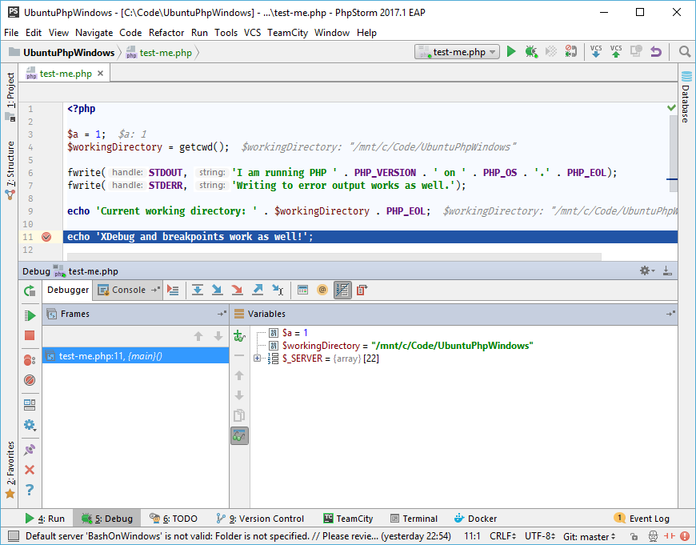
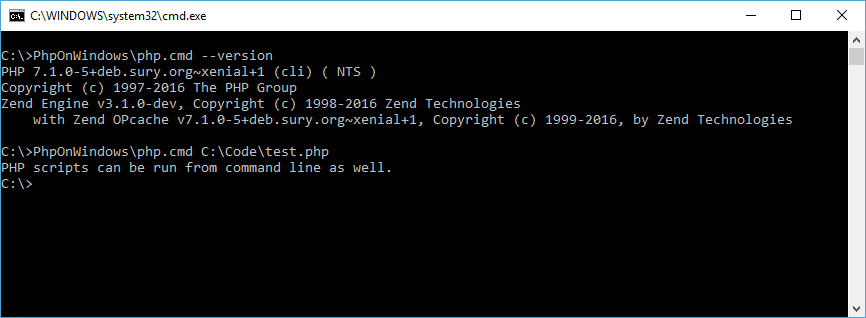
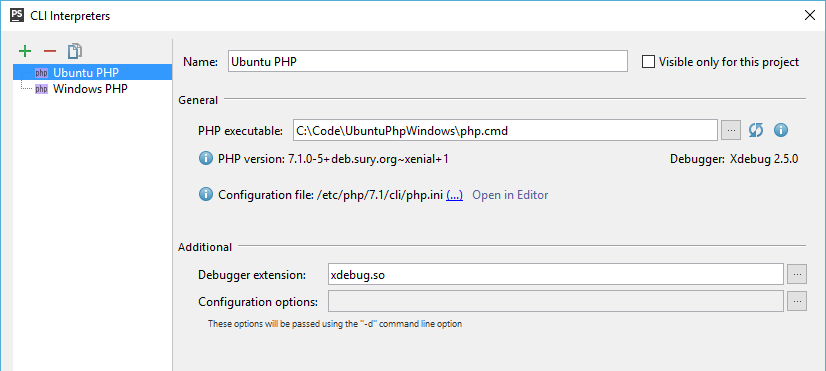

# PhpOnWindows

This is bridge from Windows to PHP installed under Windows Linux subsystem 
    ([Bash on Ubuntu on Windows](https://msdn.microsoft.com/en-us/commandline/wsl/))
    providing native integration for JetBrains IDEs, full XDebug support and simplicity for running PHP scripts.

> **NOTE:** This project is proof of concept. **Use in development environments only!** 
> Expect bugs when stepping outside of the happy path.

## Prerequisites

* Windows PHP distribution
* [Bash on Ubuntu on Windows](https://msdn.microsoft.com/en-us/commandline/wsl/install_guide)
* PHP distribution inside that Ubuntu

## Installation

1. Clone this repository somewhere (e.g. `C:\PhpOnWindows`).

2. Create file `.php-path` inside that directory. Write absolute path to your `php.exe` to that file. 
   (e.g. `echo C:\PHP\php.exe > C:\PhpOnWindows\.php-path`)

## Usage

1. Use `php.cmd` script just as if it was your regular PHP executable.

Working directory is preserved. File paths in command arguments are mapped into `/mnt/<drive>/` folder automatically. 

## Usage in JetBrains IDE

1. Create new PHP configuration and set your `php.cmd` as PHP executable.

2. That's it!

You should see that IDE reads configuration properly. XDebug, when installed, should work right now.

## How it works?

User starts `php.cmd` batch.

Batch file starts Windows PHP process by running `php-bridge.php` script and passes to it all command line arguments.

Script starts `bash.exe` with arguments to run the PHP script inside the Linux. But before composing the command line
passed to the Bash, following must be done:

* Windows-like file path is mapped to Linux-like (basically `C:\...` gets mapped to `/mnt/c/`).

* If XDebug settings are found inside command line arguments, XDebug "proxy" is started. As IDE and XDebug instance
  exchange file paths between each other, script takes care of file paths mapping as well.
  
Standard output and error output are preserved. Exit code returned by the script is preserved as well.

## Troubleshooting

Open `php.cmd` file and set `PHP_IN_BASH_LOGGING` variable to `1`. Then watch the script output during next run.

In case of problems just drop me a message, file an issue or create a pull request.

## Contact

Michal Kočárek <michal.kocarek@brainbox.cz> – <https://twitter.com/michalkocarek>

## License

This library is licensed under the MIT License – see the [LICENSE](LICENSE) file for details.
